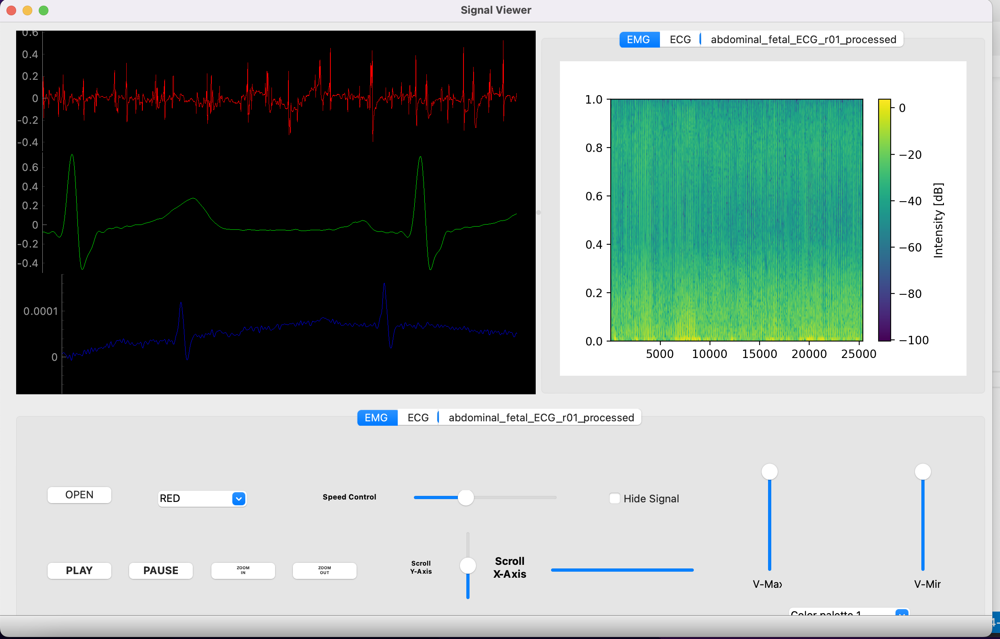
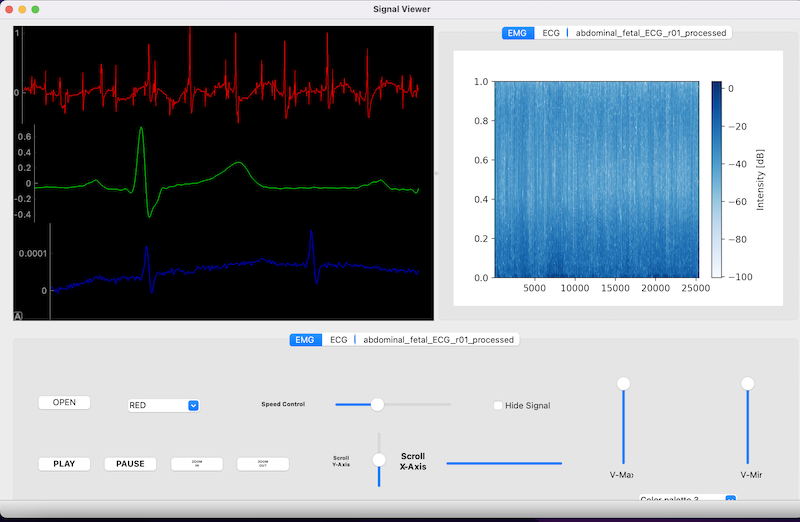

# Multi-channel signal monitor simulation

## Description

The user can browse his PC to open any signal file. 
- The application should contain one main graph. When the user opens a signal file, it should show up on your
graph in the cine mode (i.e. a running signal through time, similar to the one you see in the ICU monitors). 
- The user can manipulate the running signals through UI elements that provide the below function:
• Change color
• Add a label/title for each signal
• Show/hide
• Scroll/Pan the signal is any direction (left, top, right, bottom). Scroll is through sliders, and pan is
through the mouse movements.
- For each opened signal, the user can visualize the signal spectrogram image somewhere beside the main graph.
• The user can control/customize the relative size of the signal graph and the spectrogram image via dragging a splitter.
• The UI can display several signals but only one spectrogram (for one of the displayed signals). The user should control which spectrogram to display via a combobox or menuitem that shows the labels/titles of the signals. When the user select the label/title of the signal s/he wants, the spectrogram should be updated accordingly.
• The color palette that is used in the spectrogram through a combo-box/drop-menu that has 5 different palettes to use from.
• The user can control the level of details shown in spectrogram by changing the range (i.e. min and max values) of the pixels intensity that are displayed. The user can control this through two sliders: one for the min value and one for the max.
- Exporting & Reporting: For the sake of reporting, the user can export the current status of the graph, spectrogram along with some data statistics on the displayed signals to a pdf file. You need to generate the pdf contents via the code. i.e. Do NOT take a snapshot image and convert it to a pdf file!
• Data statistics can be mean, std, duration, min and max values for each signal. These numbers should show up in a nice table in the pdf file. 
## Getting Started
clone the rebo , install the packages needed then run the main file

## Screenshots

<!--  -->

